<p align="center">
  <a href="https://3flix-react.vercel.app">
    
  </a>
</p>

# 3Flix — React

**Live: [3flix-react.vercel.app](https://3flix-react.vercel.app)**

A streaming platform for public-domain film and Blender's open movies, plus a
current-film catalogue from TMDB. React 19 + Vite + React Router 7 +
framer-motion, with a few small server functions that keep the API keys off
the page.

```bash
npm install
cp .env.example .env.local   # then add the keys you have (see below)
npm run dev
```

## Tech stack

<p align="center">
  
</p>

| Layer | Tech | What it does here |
| --- | --- | --- |
| Motion | framer-motion 13 | Springs, the scroll-driven opening, the sliding nav marker, the Now showing carousel |
| Routing | React Router 7 | Nested and dynamic routes; filters and search kept in the URL |
| UI | React 19 | Components, hooks, context, memoisation |
| Styling | Plain CSS | Design tokens and grid — no framework |
| Build | Vite 8 | Dev server, hot reload, production build |
| Server | Vercel Functions | `/api/*` routes that add the API keys, so none reach the page |
| Accounts | Supabase | One-time-code sign-in by email; a watchlist that follows the account |
| Data | TMDB · OMDb · Watchmode | Catalogue, posters and trailers · critics' scores · where-to-watch links |
| Streams | Internet Archive · Blender | Public-domain and Creative Commons films, played in the app |
| Quality | oxlint | Linting |

The two animations above are plain SVG files in [`docs/readme/`](docs/readme/) —
no scripts, no outside requests — and they hold still for anyone whose system
asks for reduced motion. To redraw them (the versions come from
`package.json`): `node scripts/readme-art.mjs`.

## Keys

Every key is optional; without one, that feature falls back or switches off.
They live in `.env.local` (and, for the live site, in Vercel's Environment
Variables). The API keys have **no** `VITE_` prefix: the browser calls this
site's own `/api/*` routes and the server adds the key (`server/proxy.js`),
so no key ever appears in the page's JavaScript.

| Name | What it switches on |
| --- | --- |
| `TMDB_TOKEN` | The catalogue: trending, in cinemas, top rated, posters, trailers |
| `OMDB_KEY` | IMDb, Rotten Tomatoes and Metacritic scores |
| `WATCHMODE_KEY` | A direct link to each film on each streaming service |
| `VITE_SUPABASE_URL`, `VITE_SUPABASE_ANON_KEY`, `SUPABASE_SERVICE_ROLE_KEY` | Accounts with a one-time code by email, and a watchlist that follows the account |
| `TMDB_DNS=doh` | Development only, on networks that block TMDB by DNS |

If TMDB can't be reached, "Now showing" and "Trending" use the lists saved in
`public/snapshots/` (refresh them with `node scripts/snapshots.mjs`).

## Signing in

The home page's opening plays for everyone; the moment it ends, a sign-in
pops up. Every other page is behind it. Step one is a name and an email; the
server turns away temporary inboxes (8,771 known domains) and domains that
can't receive mail. With Supabase connected, step two is a one-time code sent
to that email. Without it, visitors are signed in on their own device.

To connect Supabase (free): create a project, then in the dashboard

1. **Authentication → Sign In / Providers → Email**: turn **off** "Allow new
   users to sign up" (the server creates accounts itself, after the email check).
2. **Authentication → Emails → Templates → Magic Link**: put `{{ .Token }}` in
   the message, so it contains the code (do the same in "Confirm signup").
3. **Authentication → Emails → SMTP Settings**: add an SMTP sender (Brevo,
   Resend, or a Gmail app password). Supabase's built-in sender only mails the
   project's own team, a few times an hour.
4. **Project Settings → API**: copy the URL, the anon (publishable) key and the
   service_role (secret) key into the three variables above.

## Documents

| Document | Contents |
| --- | --- |
| [`SYLLABUS.md`](SYLLABUS.md) | Every course topic mapped to the file and line that proves it |
| [`BUILD.md`](BUILD.md) | How it was built: commands, design decisions, components, bugs |

## Routes

| Path | Page | Demonstrates |
| --- | --- | --- |
| `/` | Home | Scroll-driven opening, then the sign-in gate or the menu |
| `/signin` | Sign in | Controlled multi-step form, validation, redirect back |
| `/library` | Library | Lifted state, `useMemo`, controlled search |
| `/library/:filmId` | Film detail | Nested + dynamic route, `useParams`, `useRef`, subtitles |
| `/movies` | Movies (TMDB) | URL state, paged fetching, `AbortController` |
| `/movies/:movieId` | Movie detail | Dynamic route, trailer facade, where to watch |
| `/watchlist` | Watchlist | Context |
| `/about` | About | Semantic HTML |
| `/films` | → `/library` | Redirect |
| anything else | 404 | Wildcard route |

Everything except `/` and `/signin` sits behind `<ProtectedRoute>`.

The sibling folder `../3flix/` is the same product built with no framework and
no build step — evidence for the HTML/CSS/vanilla-JS modules.

## Deploying

The live site is a Vercel **prebuilt** deploy: built locally, then uploaded.
The server keys must also be set in Vercel → Project → Settings →
Environment Variables (Production), because the `/api/*` functions run there.

```bash
vercel build --prod
vercel deploy --prebuilt --prod
```

Pushes to GitHub do not deploy (`"git": { "deploymentEnabled": false }` in
`vercel.json`). To switch on deploy-on-push, add every variable above in
Vercel, then delete the `git` block from `vercel.json`.
