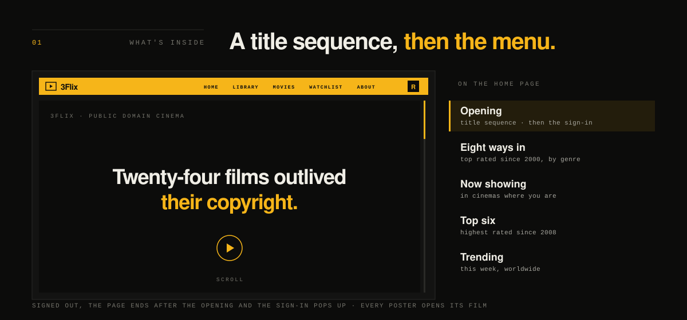

<p align="center">
  <a href="https://3flix-react.vercel.app">
    
  </a>
</p>

# 3Flix — React

**Live: [3flix-react.vercel.app](https://3flix-react.vercel.app)**

Twenty-four public-domain classics that play right in the page, and a live
catalogue of new and popular films from TMDB — official posters, trailers,
critics' scores and where each one streams. React 19 + Vite + React Router 7 +
framer-motion, with a few small server functions that keep the API keys off
the page

```bash
npm install
cp .env.example .env.local   # then add the keys you have (see below)
npm run dev
```

## What's inside

<p align="center">
  
</p>

| Section | What it is |
| --- | --- |
| Opening | A scroll-driven title sequence; signed out, the sign-in pops up the moment it ends |
| Eight ways in | Eight genres, each with its three best-rated films of 2000 onward — no film twice on the page |
| Now showing | What's in cinemas where you are, as a filmstrip whose backdrop takes each poster's colour |
| Top six | The highest-rated films released since 2008, ranked among films with 15,000+ votes |
| Trending | This week's most-watched films worldwide |
| Library | The 100 most popular films of 2023–2025, searchable by title and genre; a classic opens its player here |
| Watchlist | A star on every film — classic or new — saves it to your watchlist |

## Tech stack

<p align="center">
  
</p>

| Layer | Tech | What it does here |
| --- | --- | --- |
| Motion | framer-motion 13 | Springs, the scroll-driven opening, the sliding nav marker, the Now showing carousel |
| Routing | React Router 7 | Nested and dynamic routes; filters and search kept in the URL |
| UI | React 19 | Components, hooks, context, memoisation |
| Styling | Plain CSS | Design tokens and grid — no framework |
| Build | Vite 8 | Dev server, hot reload, production build |
| Server | Vercel Functions | `/api/*` routes that add the API keys, so none reach the page |
| Automation | GitHub Actions | Refreshes the saved "in cinemas" and "trending" lists every morning |
| Data | TMDB · OMDb · Watchmode | Catalogue, posters and trailers · critics' scores · where-to-watch links |
| Streams | Internet Archive | The public-domain classics, played in the app |
| Quality | oxlint | Linting |

## Keys

<p align="center">
  
</p>

Every key is optional; without one, that feature falls back or switches off.
They live in `.env.local` and, for the live site, in Vercel's Environment
Variables. None has a `VITE_` prefix: the browser calls this site's own
`/api/*` routes and the server adds the key (`server/proxy.js`), so no key ever
appears in the page's JavaScript.

| Name | What it switches on |
| --- | --- |
| `TMDB_TOKEN` | The catalogue: trending, in cinemas, top rated, posters, trailers |
| `OMDB_KEY` | IMDb, Rotten Tomatoes and Metacritic scores |
| `WATCHMODE_KEY` | A direct link to each film on each streaming service |
| `TMDB_DNS=doh` | Development only, on networks that block TMDB by DNS |

If TMDB can't be reached, "Now showing" and "Trending" use the lists saved in
`public/snapshots/`. A GitHub Action refreshes them every morning; it needs
`TMDB_TOKEN` as a repository secret (Settings → Secrets and variables →
Actions). To refresh them by hand: `node scripts/snapshots.mjs`.

## Signing in

<p align="center">
  
</p>

The home page's opening plays for everyone; the moment it ends, a sign-in
pops up over it. Every other page is behind it, and a link that lands on one
while signed out goes to `/signin` first, then on to where it was headed.

Signing in is one step — a name and an email address, no password and no
code. The server checks the address is real before letting anyone in: the
format, a list of 8,771 temporary-mail domains (and their subdomains), and a
DNS lookup for the domain's mail record. The profile is then remembered in
the browser, and the form is prefilled on the next visit. The nav bar has no
"Sign in" button — only an account menu with Change name and Sign out.

## Routes

<p align="center">
  
</p>

| Path | Page | Demonstrates |
| --- | --- | --- |
| `/` | Home | Scroll-driven opening, then the sign-in gate or the menu |
| `/signin` | Sign in | Controlled form, server-side validation, redirect back |
| `/library` | Library | Lifted state, `useMemo`, controlled search |
| `/library/:filmId` | Film detail | Nested + dynamic route, `useParams`, `useRef`, resume where you left off |
| `/movies` | Movies (TMDB) | URL state, paged fetching, `AbortController` |
| `/movies/:movieId` | Movie detail | Dynamic route, trailer facade, scores, where to watch |
| `/watchlist` | Watchlist | Context |
| `/about` | About | Semantic HTML |
| `/films` | → `/library` | Redirect |
| anything else | 404 | Wildcard route |

Everything except `/` and `/signin` sits behind `<ProtectedRoute>`.

The sibling folder `../3flix/` is the same product built with no framework and
no build step — evidence for the HTML/CSS/vanilla-JS modules.

## Deploying

<p align="center">
  
</p>

Every push to `main` deploys: Vercel builds the site (`npm run build`) and the
four `/api/*` functions, and the new version goes live when the build is ready.
The functions read their keys from Vercel → Project → Settings → Environment
Variables (Production), so set the keys there as well as in `.env.local`.

To deploy by hand instead: `vercel --prod`.

## Contributors

<p align="center">
  
</p>

Counted from the git history, not written by hand. Each bar is a share of
the lines changed — the work itself — rather than of commits, so a one-line
fix and a whole feature don't count the same. Co-authors come from the
commits' `Co-Authored-By` lines (Claude worked on this project as an AI pair
programmer), and automated commits are kept apart from people. Teammates are listed under `"contributors"` in `package.json`, each with
the name to show and their git author name (`{ "name": "Maulik", "git":
"g4_0907" }`); anyone listed appears even before their first commit, and
their bar grows with their own commits. Redraw it after new work lands with `node scripts/readme-art.mjs`.

## Documents

| Document | Contents |
| --- | --- |
| [`SYLLABUS.md`](SYLLABUS.md) | Every course topic mapped to the file and line that proves it |
| [`BUILD.md`](BUILD.md) | How it was built: commands, design decisions, components, bugs |
| [`PROMPTS.md`](PROMPTS.md) | The component prompts the design started from |

Every animation in this README is a plain SVG file in
[`docs/readme/`](docs/readme/) — no scripts, no outside requests — and each
holds still on a meaningful frame for anyone whose system asks for reduced
motion. They are drawn by `node scripts/readme-art.mjs`, which reads the
versions from `package.json` and the contributors from git.
